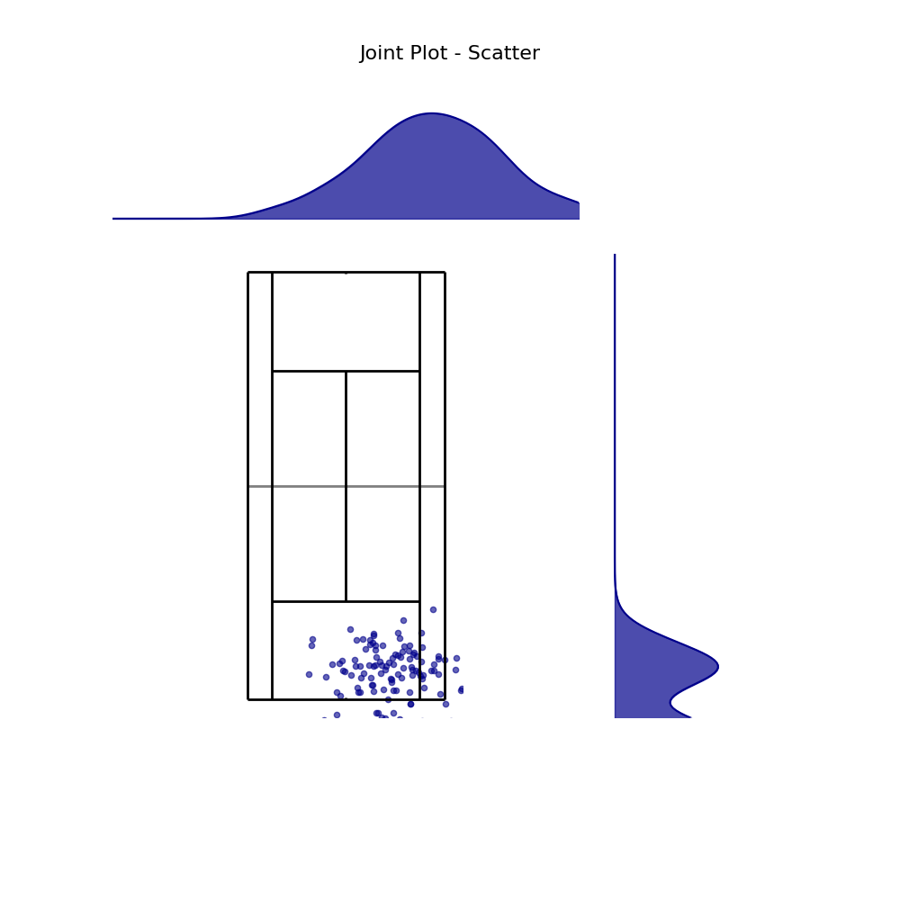

# Advanced Visualizations

For analyzing shot distributions and patterns, ``BsuTennis`` provides advanced density and joint plots.

## Kernel Density Estimation (KDE)

Visualize shot density with smooth contours.

```python
# Standard Green KDE
court.kdeplot(ax, x, y, cmap='bsu_green', levels=100)

# Clipped Red KDE (e.g., Forehands)
court.kdeplot(ax, x, y, cmap='bsu_red', clip=((-4.1, 4.1), (0, 11.89)))
```

### Custom Colormaps
We provide tailored colormaps that work well on white backgrounds:
- ``bsu_green`` (default)
- ``bsu_red``
- ``bsu_blue``


## Grid Heatmaps (Bin Statistic)

Visualize frequencies across a defined grid (similar to typical soccer analysis plots).

```python
# 5x5 Grid with Annotations
court.heatmap(ax, x, y, bins=(5, 5), statistic='frequency', annot=True, cmap='Blues')
```
- **bins**: Number of grid cells ``(nx, ny)``.
- **statistic**: ``'count'`` or ``'frequency'``.
- **annot**: Show values in cells.


## Hexbin Plots

Create honeycomb-style density maps for a modern aesthetic.

```python
court.hexbin(ax, x, y, gridsize=20, cmap='bsu_blue', edgecolors='white', mincnt=1)
```


## Joint Grid Plots

Visualize the main court plot alongside marginal distributions (histograms/densities) of x and y coordinates.

```python
from BsuTennis import joint_plot

# Scatter with Marginals
fig, axes = joint_plot(x, y, kind='scatter', theme='bsu')

# KDE with Marginals
fig, axes = joint_plot(x, y, kind='kde', theme='bsu')
```


