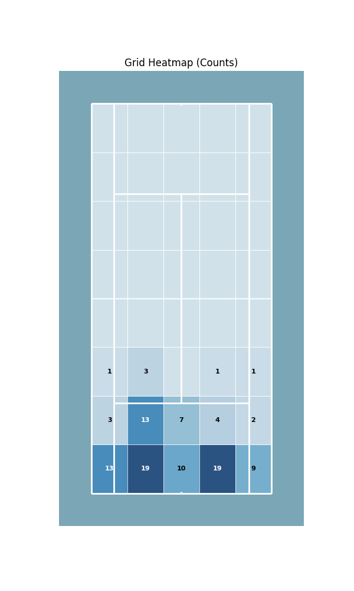

# Advanced Visualizations

Density plots, heatmaps, and joint distributions for in-depth shot pattern analysis.

---

## KDE (Kernel Density Estimation)

Smooth contour plots showing shot concentration.

| Green | Red | Blue |
| :---: | :---: | :---: |
|  |  |  |

```python
court.kdeplot(ax, x, y, cmap='bsu_green', levels=50, alpha=0.6)
```

**Colormaps**: `bsu_green`, `bsu_red`, `bsu_blue`

---

## Heatmap (Grid)

Frequency distribution across grid cells.

| Counts | Frequency (%) |
| :---: | :---: |
|  |  |

```python
court.heatmap(ax, x, y, gridsize=8, statistic='frequency', half=True)
```

---

## Hexbin

Honeycomb-style density visualization.

| Full Court | Half Court |
| :---: | :---: |
|  |  |

```python
court.hexbin(ax, x, y, gridsize=20, cmap='bsu_green', half=True)
```

---

## Pizza Chart

Radial bar charts for player performance metrics.

| BSU Theme | Comparison |
| :---: | :---: |
|  |  |

```python
from BsuTennis import pizza

stats = {'Aces': 85, 'Winners': 72, '1st Serve %': 68}
fig, ax = pizza('Player Name', stats, theme='bsu')
```

---

## Sonar Chart

Shot direction distribution from court zones.

| 6-Direction | 8-Direction | Custom |
| :---: | :---: | :---: |
|  |  |  |

```python
from BsuTennis import sonar_from_shots

sonar_from_shots(ax, shot_x, shot_y, shot_dx, shot_dy,
                 n_zones_x=3, n_zones_y=2, n_directions=6)
```

---

## Joint Plots

Court visualization with marginal distributions.

### Full Court (Two Players)


```python
from BsuTennis import joint_plot

fig, ax = joint_plot(p1_x, p1_y, p2_x, p2_y, kind='kde', half=False)
```

### Half Court

| Scatter | Grid |
| :---: | :---: |
|  |  |


```python
fig, ax = joint_plot(x, y, kind='scatter', half=True)
fig, ax = joint_plot(x, y, kind='grid', half=True)
fig, ax = joint_plot(x, y, kind='kde', half=False)
```

**Types**: `scatter`, `kde`, `grid`
