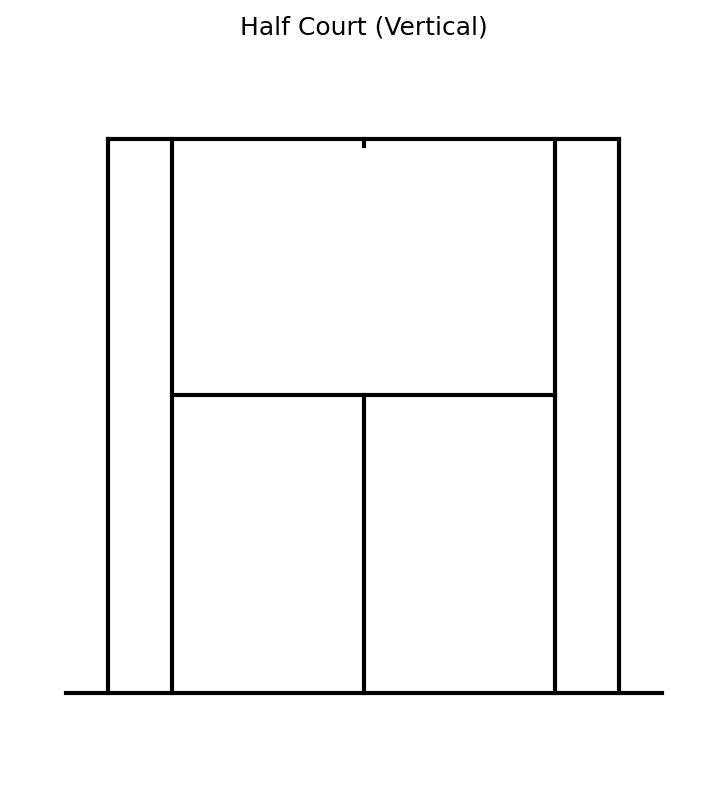

# Court Visualizations

The ``TennisCourt`` class is the foundation of BsuTennis. It draws courts and overlays data with various orientations and themes.

---

## Quick Start

```python
from BsuTennis import TennisCourt
import matplotlib.pyplot as plt

court = TennisCourt(theme='bsu', half=True)
fig, ax = plt.subplots(figsize=(6, 8))
court.draw(ax=ax)
plt.show()
```

---

## Court Themes

| BSU | Hard | Clay | Grass |
| :---: | :---: | :---: | :---: |
|  |  |  |  |

```python
court = TennisCourt(theme='bsu')   # Default
court = TennisCourt(theme='hard')
court = TennisCourt(theme='clay')
court = TennisCourt(theme='grass')
```

---

## Court Orientations

| Full Court | Half Court |
| :---: | :---: |
|  |  |

```python
# Full court
court = TennisCourt(half=False)

# Half court (recommended for analysis)
court = TennisCourt(half=True)
```

---

## Scatter Plots

Visualize shot landing points with customizable markers.


```python
court.scatter(ax, x, y, color='#e74c3c', s=60, alpha=0.8)
```

### Preset Styles


```python
court.scatter(ax, x, y, style='winner_fh')  # Red star
court.scatter(ax, x, y, style='ue')         # Error marker
```

**Styles**: `winner_fh`, `winner_bh`, `forcing_fh`, `forcing_bh`, `ue`, `fe`, `ace`

---

## Arrow Trajectories

Draw shot directions with customizable arrows.


```python
court.arrows(ax, x_start, y_start, x_end, y_end,
             color='#e74c3c',      
             linewidth=2,          
             arrow_style='fancy')  # fancy/simple/wedge/curve
```

---

## Guide Lines & Zones

Overlay tactical zones for serve analysis.

| Vertical | Horizontal |
| :---: | :---: |
|  |  |

```python
court.draw_guides(ax, service_vertical_lines=2, backcourt_line=True)
```

---

## Multi-Court Grids

Compare multiple players or scenarios side-by-side.

| 1×3 Grid | 2×3 Grid | 3×3 Grid |
| :---: | :---: | :---: |
|  |  |  |

```python
from BsuTennis import create_court_grid

fig, axes, courts = create_court_grid(nrows=2, ncols=3, half=True)
for ax, court in zip(axes.flat, courts):
    court.draw(ax=ax)
```

---

## Text Annotations

Add labels directly on the court.

```python
court.annotate(ax, x=0, y=5, text='Service Box', fontsize=12, color='white')
```
