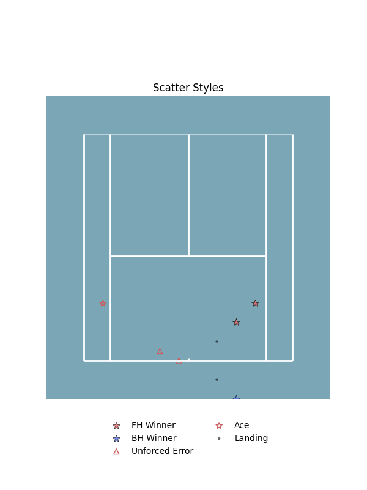
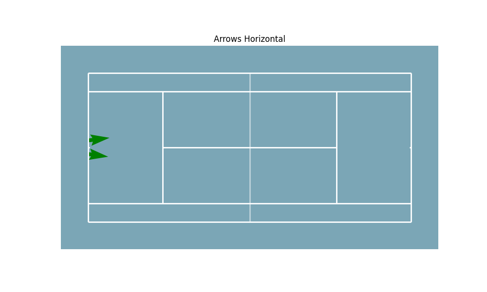

# Court Visualizations

The core of ``BsuTennis`` is the ``TennisCourt`` class, which allows you to draw tennis courts and overlay various types of data.

## Creating a Court

You can create a court instance with varying orientations and themes.

```python
import matplotlib.pyplot as plt
from BsuTennis import TennisCourt

fig, ax = plt.subplots(figsize=(6, 10))
court = TennisCourt(orientation='vertical', half=False, theme='bsu')
court.draw(ax=ax)
plt.show()
```

### Parameters
- **orientation**: ``'vertical'`` (default) or ``'horizontal'``.
- **half**: ``True`` (draw only half court) or ``False`` (full court).
- **theme**: Color theme (e.g., ``'bsu'``, ``'hard'``, ``'clay'``, ``'grass'``).

## Scatter Plots (Events)

Use ``scatter`` to plot shot landing points. You can apply predefined styles for common events like winners or errors.

```python
# Generic Scatter
court.scatter(ax, x_data, y_data, color='blue', s=20)

# Styled Events
from BsuTennis import SCATTER_STYLES

# Forehand Winner (Red Star)
court.scatter(ax, x_win, y_win, style='winner_fh')

# Unforced Error (Red Triangle)
court.scatter(ax, x_err, y_err, style='ue')
```

### Available Styles
Styles mimic standard tennis analysis visual markers. defined in ``SCATTER_STYLES``:

- ``winner_fh`` / ``winner_bh`` / ``winner``
- ``forcing_fh`` / ``forcing_bh`` / ``forcing``
- ``ue`` (Unforced Error) / ``fe`` (Forced Error)
- ``ace``



## Trajectories (Arrows)

Use ``arrows`` to visualize shot direction or player movement.

```python
court.arrows(ax, x_start, y_start, x_end, y_end, color='white', width=0.005)
```


