# Court Visualizations

The ``TennisCourt`` class is the foundation of BsuTennis visualization. It provides intuitive methods for drawing courts and overlaying data.

---

## Quick Start

```python
from BsuTennis import TennisCourt
import matplotlib.pyplot as plt

court = TennisCourt(theme='bsu', half=True)
fig, ax = plt.subplots(figsize=(6, 8))
court.draw(ax=ax)
plt.show()
```

---

## Court Themes

Choose from multiple court surface themes for different visual styles.

| BSU (Default) | Hard Court | Clay Court | Grass Court |
| :---: | :---: | :---: | :---: |
|  | 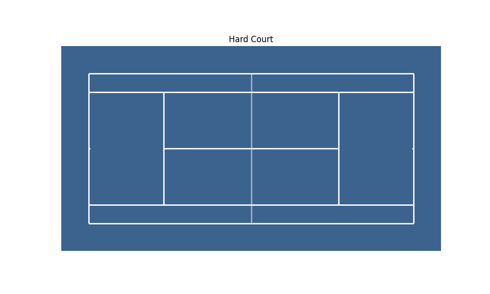 |  | 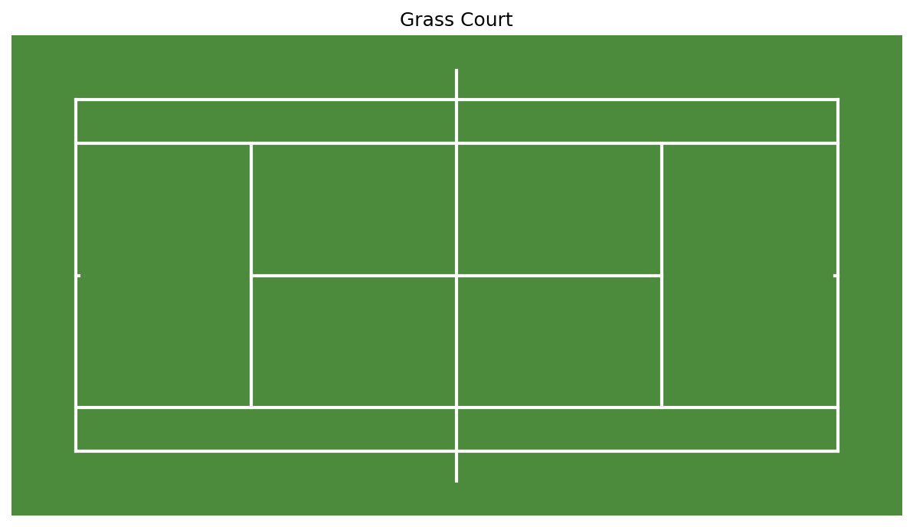 |

```python
# Available themes: 'bsu', 'hard', 'clay', 'grass'
court = TennisCourt(theme='clay')
```

---

## Court Orientations

| Full Court (Horizontal) | Half Court (Vertical) |
| :---: | :---: |
| 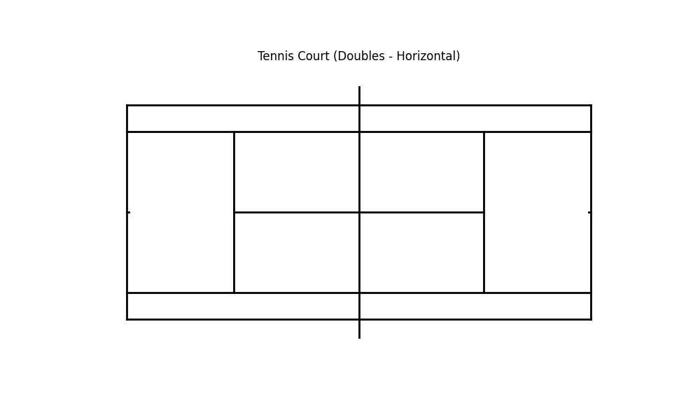 | 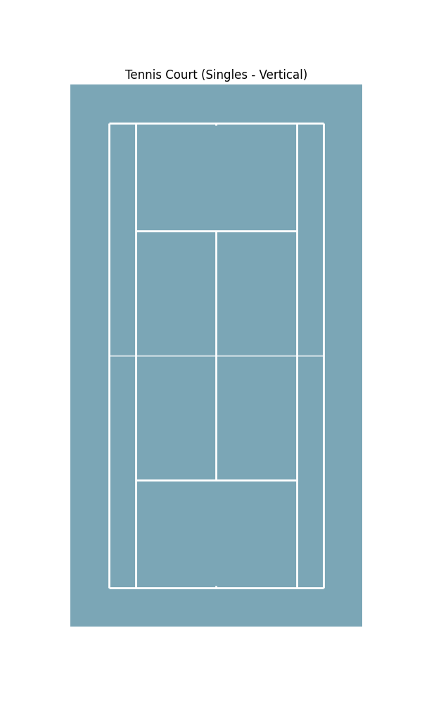 |

```python
# Full court (default: horizontal)
court = TennisCourt(half=False)

# Half court (default: vertical)
court = TennisCourt(half=True)
```

---

## Scatter Plots

Visualize shot landing points with customizable markers.

````carousel
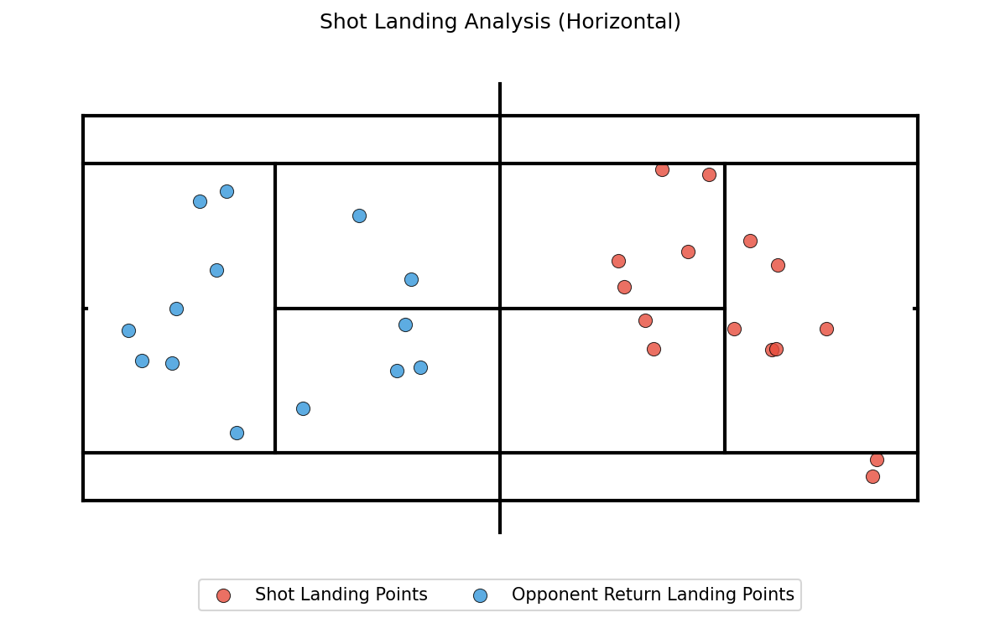
<!-- slide -->
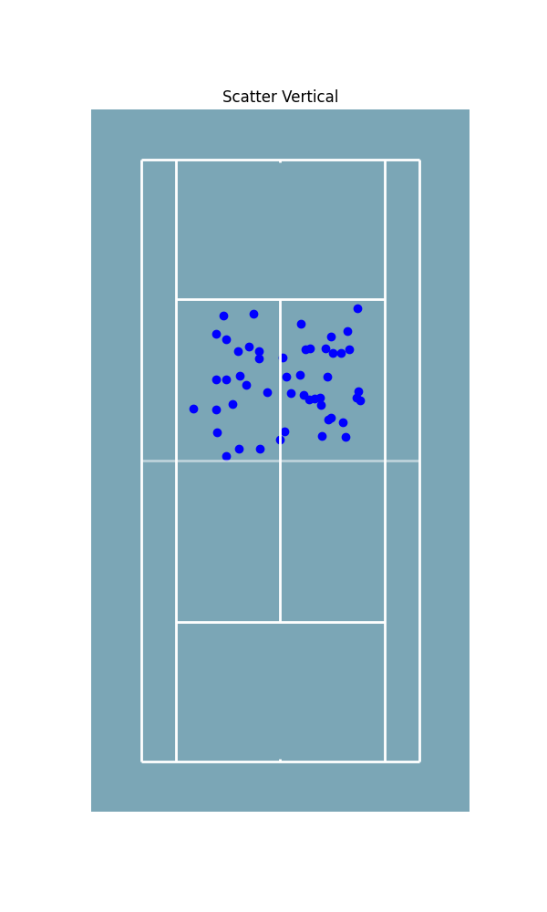
````

```python
court.scatter(ax, x, y, color='#e74c3c', s=60, alpha=0.8)
```

### Preset Styles

Quick styling for common event types:


```python
court.scatter(ax, x, y, style='winner_fh')  # Red star
court.scatter(ax, x, y, style='ue')         # Error marker
```

**Styles**: `winner_fh`, `winner_bh`, `forcing_fh`, `forcing_bh`, `ue`, `fe`, `ace`

---

## Arrow Trajectories

Draw shot directions with customizable arrows.

```python
court.arrows(ax, x_start, y_start, x_end, y_end,
             color='#e74c3c',      # Color
             linewidth=2,          # Thickness
             linestyle='solid',    # solid/dashed/dotted
             arrow_style='fancy')  # fancy/simple/wedge/curve
```

---

## Guide Lines & Zones

Overlay tactical zones for serve analysis.

| Vertical (3 Zones) | Horizontal (2 Zones) |
| :---: | :---: |
| 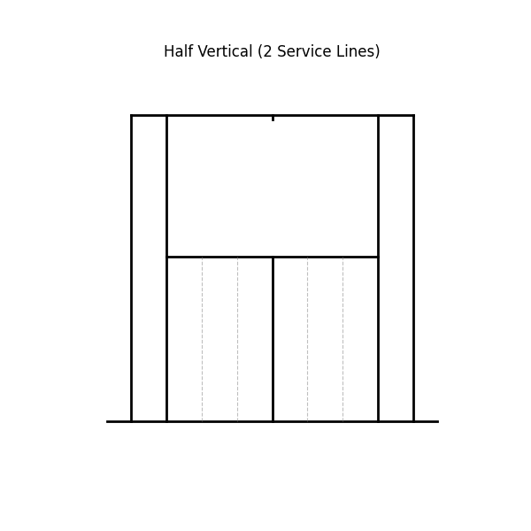 | 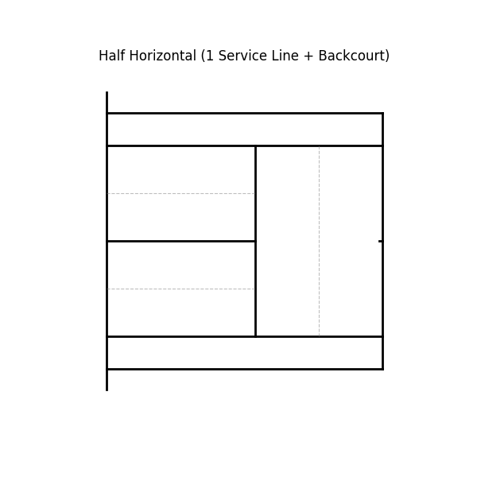 |

```python
court.draw_guides(ax, service_vertical_lines=2, backcourt_line=True)
```

---

## Multi-Court Grids

Compare multiple players or scenarios side-by-side.

````carousel
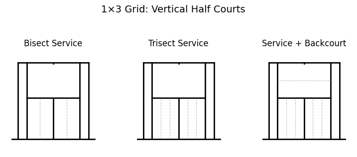
<!-- slide -->
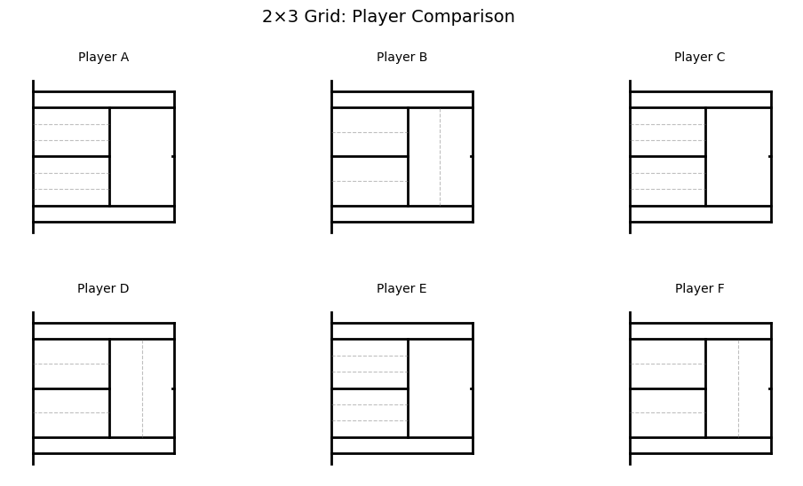
<!-- slide -->
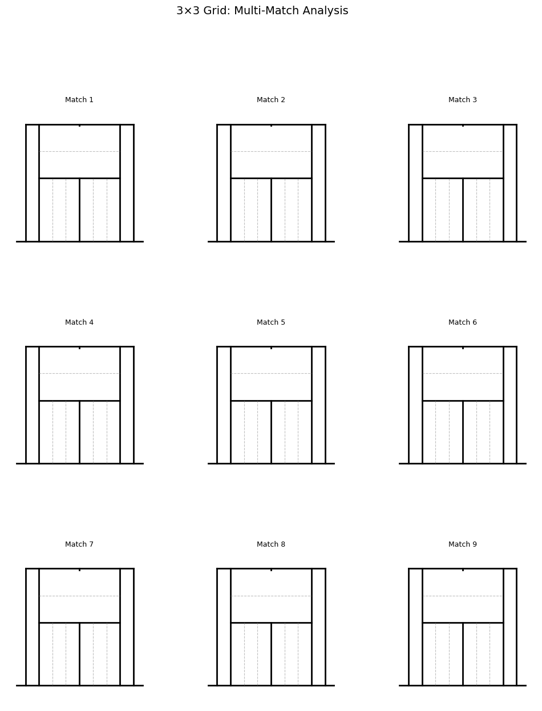
````

```python
from BsuTennis import create_court_grid

fig, axes, courts = create_court_grid(nrows=2, ncols=3, half=True)
for ax, court in zip(axes.flat, courts):
    court.draw(ax=ax)
```
