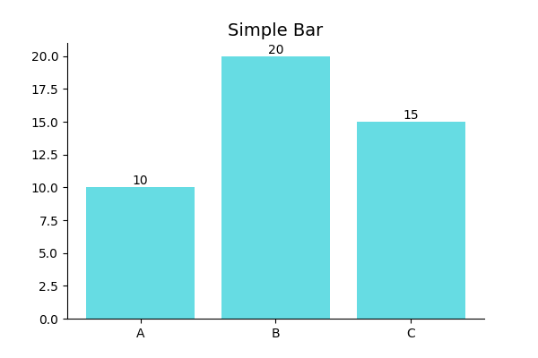
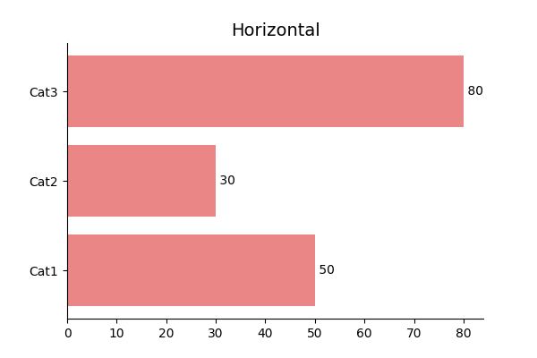
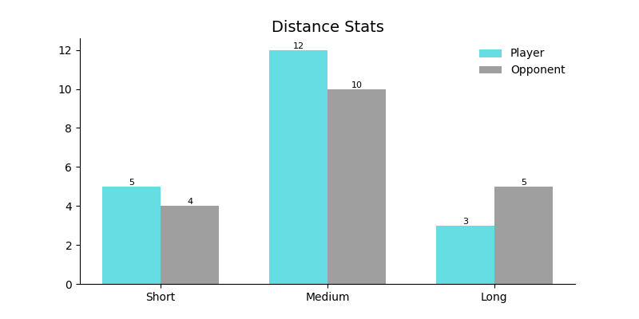
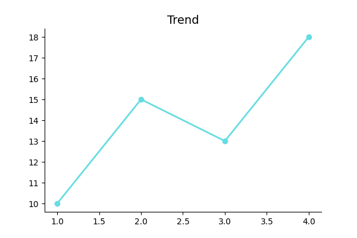
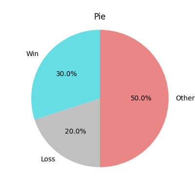
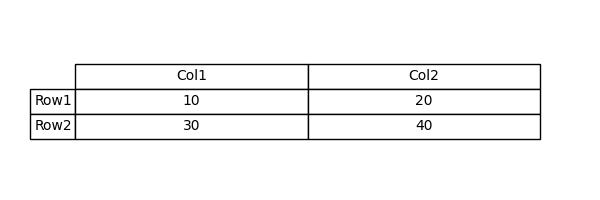

# Statistical Charts

General statistical visualizations with consistent styling for tennis analytics reports.

---

## Bar Charts

### Vertical Bar



```python
from BsuTennis import plot_bar

fig, ax = plt.subplots()
plot_bar(ax, categories=['Set 1', 'Set 2', 'Set 3'], 
         values=[6, 4, 7], title='Games Won')
```

### Horizontal Bar



```python
from BsuTennis import plot_horizontal_bar

plot_horizontal_bar(ax, categories=['Aces', 'Winners', 'Errors'], 
                    values=[12, 28, 15])
```

### Comparison Bar



```python
from BsuTennis import plot_bar_comparison

plot_bar_comparison(ax, 
    categories=['1st Serve %', 'Aces', 'Winners'],
    values1=[68, 12, 32], values2=[72, 8, 28],
    label1='Player A', label2='Player B')
```

---

## Line Chart



```python
from BsuTennis import plot_line

plot_line(ax, x=[1, 2, 3, 4, 5], y=[65, 70, 68, 75, 72])
```

---

## Pie Chart



```python
from BsuTennis import plot_pie

plot_pie(ax, values=[60, 25, 15], 
         labels=['Winners', 'Errors', 'Net Points'])
```

---

## Table



```python
from BsuTennis import plot_table

plot_table(ax, 
    data=[['6-4', '7-5'], ['4-6', '5-7']],
    columns=['Set 1', 'Set 2'],
    rows=['Player A', 'Player B'])
```

---

## Pizza Chart

Radial bar charts for player performance metrics.

| BSU Theme | Comparison |
| :---: | :---: |
|  |  |

```python
from BsuTennis import pizza

stats = {'Aces': 85, 'Winners': 72, '1st Serve %': 68}
fig, ax = pizza('Player Name', stats, theme='bsu')
```

---

## Radar Chart


```python
from BsuTennis import Radar

radar = Radar(params=['Speed', 'Power', 'Accuracy', 'Stamina', 'Mental'],
              min_range=[0, 0, 0, 0, 0], max_range=[100, 100, 100, 100, 100])
fig, ax = radar.setup_axis()
radar.draw_circles(ax, num_rings=5)
radar.draw(ax, [85, 78, 92, 80, 88], label='Player A', color='#e74c3c')
plt.legend()
```
