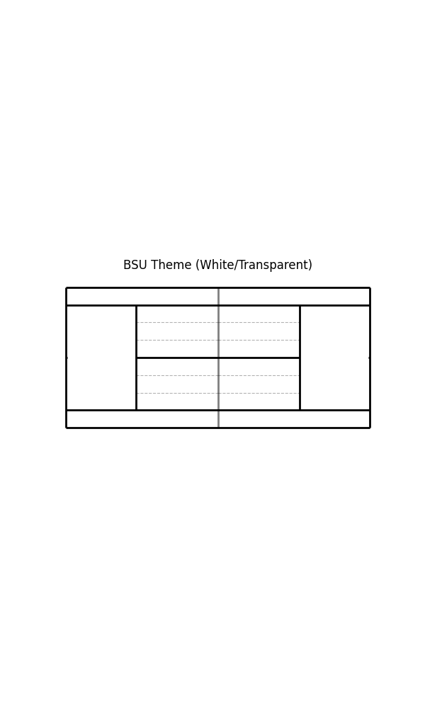
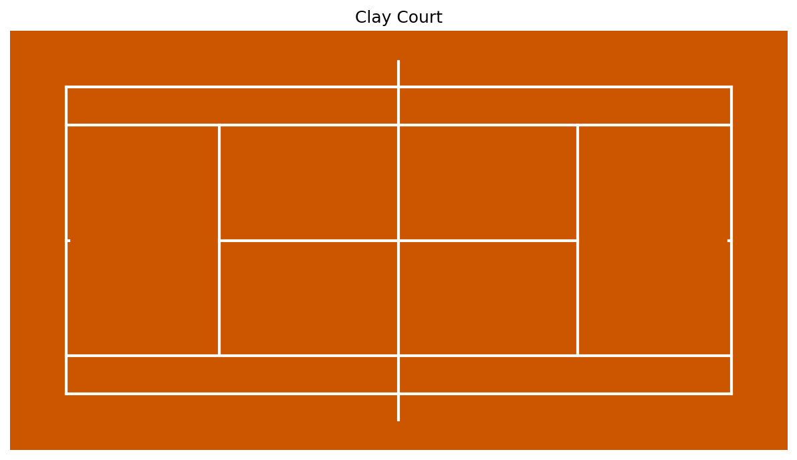

# Themes and Customization

``BsuTennis`` comes with built-in color themes to instantly change the look of your court visualizations.

## Applying a Theme

Pass the ``theme`` argument when initializing ``TennisCourt`` or calling ``joint_plot``.

```python
# Create a Clay Court
court = TennisCourt(theme='clay')
```

## Built-in Themes

| Theme Name | Description | Pitch Color | Line Color |
| :--- | :--- | :--- | :--- |
| ``'bsu'`` | Default BSU style (Light Blue/white) | Transparent | Black |
| ``'hard'`` | Standard Hard Court (Blue) | #3C638E | White |
| ``'clay'`` | Clay Court (Orange) | #CC5500 | White |
| ``'grass'`` | Grass Court (Green) | #4B8B3B | White |
| ``'dark'`` | Dark Mode (Black/Grey) | #222222 | #cfcfcf |
| ``'light'`` | Minimal Light Mode | #f9f9f9 | Black |




## Customizing Elements

You can further customize plots using standard Matplotlib arguments (kwargs).

- **Scatter Styles**: Use ``SCATTER_STYLES`` presets (e.g., ``'winner_fh'``) in `scatter()`.
- **KDE Colors**: Use ``bsu_red``, ``bsu_blue``, ``bsu_green`` colormaps in `kdeplot()` and `heatmap()`.
